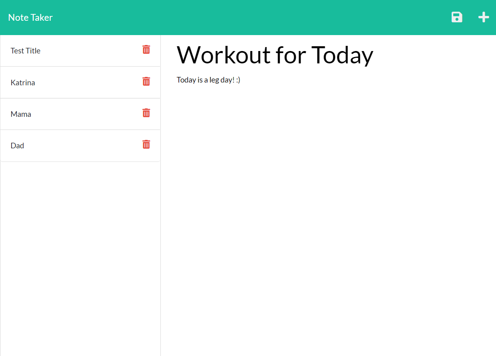

# NoteTaker

## Description
This note taker app allows users to have all their thoughts in one app. 

Here is a screenshot of the app in action.

## Technologies Used
* CSS
* Express
* HTML
* JavaScript
* Node.js
* UUID
* Yarn

## Installation
* Please download the starter code from this repository.
* Then, download Express, Node, and UUID.

## Links
* GitHub: https://github.com/krod2016/NoteTaker
* Heroku: https://intense-wildwood-98710.herokuapp.com/

## Made by:
Katrina Rodriguez